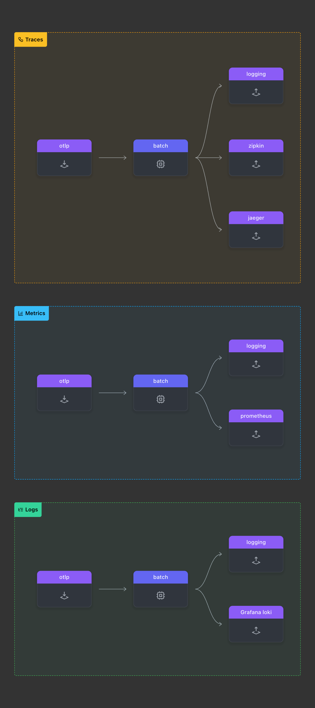
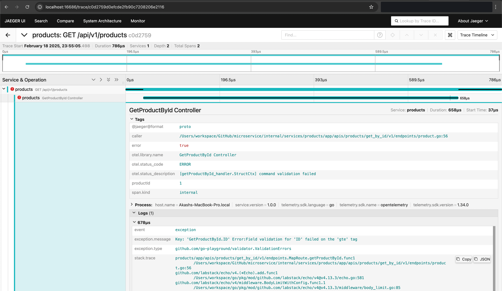
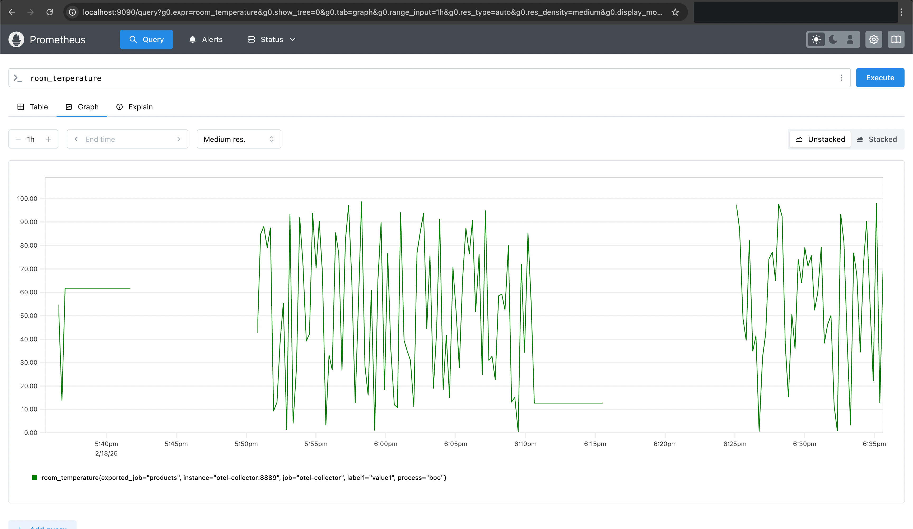
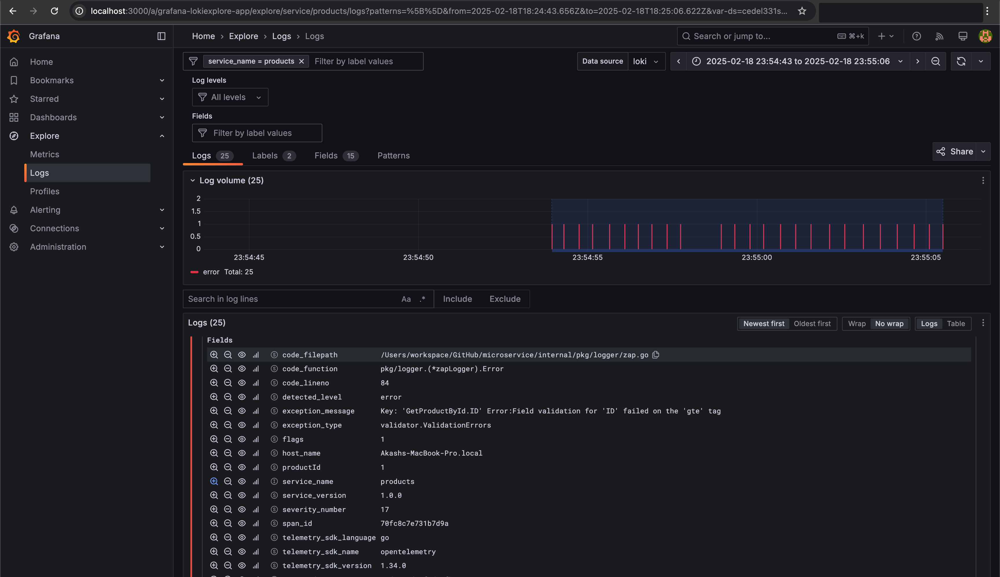
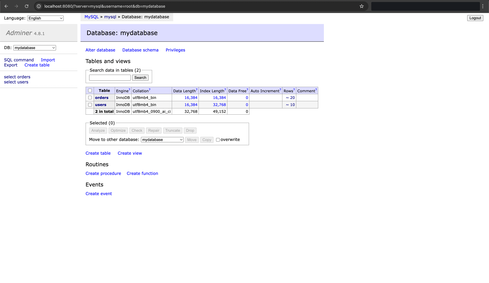

# Monitoring 
- **Jaeger** : [http://localhost:16686](http://localhost:16686)
- **Prometheus** : [http://localhost:9090](http://localhost:9090)
- **Grafana** : [http://localhost:3000](http://localhost:3000)
- **Consul** : [http://localhost:8500](http://localhost:8500)
- **Adminer** : [http://localhost:8080](http://localhost:8080)

## OpenTelemetry Collector
- The OpenTelemetry Collector is used for collecting and exporting telemetry data.

### Container:
- `otel-collector`: This container runs the OpenTelemetry Collector, which collects and exports telemetry data to various backends.

## Additional Configuration
The OpenTelemetry Collector configuration file can be found in the `telementry/` directory:
- `otel-collector-config.yaml`

--- 

## Jaeger
- Jaeger is used for tracing and monitoring microservices. 
- The configuration files for Jaeger can be found in the `discovery/` directory:
    - `client.json`
    - `server.json`

### Container:
- `jaeger-all-in-one`: This container runs the Jaeger all-in-one image, which includes the Jaeger UI, collector, query, and agent.

___

## Prometheus
- Prometheus is used for scraping and storing metrics. 
- The configuration file for Prometheus can be found in the `prometheus/` directory:
    - `prometheus.yaml`

### Container:
- `prometheus`: This container runs the Prometheus server, which scrapes and stores metrics data.

---

## Grafana
- Grafana is used for visualizing metrics and logs. 
- The configuration file for Grafana can be found in the `grafana/` directory:
    - `loki-config.yaml`

### Containers:
- `grafana`: This container runs the Grafana server, which provides a web interface for visualizing metrics and logs.
- `loki`: This container runs Loki, a log aggregation system that integrates with Grafana for log visualization.

---

## Consul
- Consul is used for service discovery and configuration. 
- The configuration files for Consul can be found in the `discovery/` directory:
    - `client.json`
    - `server.json`

### Containers:
- `consul-server`: This container runs the Consul server, which manages the service discovery and configuration.
- `consul-client`: This container runs the Consul client, which registers services with the Consul server.

## Adminer
- Adminer is used for managing databases. 
- No additional configuration files are required for Adminer.

### Container:
- `adminer`: This container runs Adminer, a web-based database management tool.

## MySQL
- MySQL is used as a relational database management system.

### Container:
- `mysql`: This container runs the MySQL database server.

## Zipkin
- Zipkin is used for distributed tracing.

### Container:
- `zipkin-all-in-one`: This container runs the Zipkin all-in-one image, which includes the Zipkin UI, collector, and storage.

